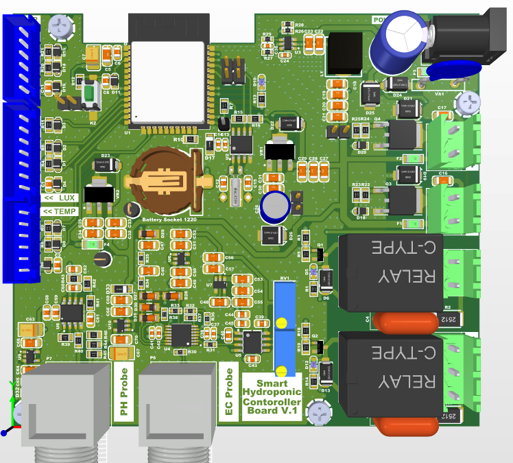

# ESP32 Greenhouse Controller

An ESP32-based greenhouse controller designed to monitor environmental conditions and control different greenhouse equipment.

## Overview

The ESP32 acts as the main controller of the system. It collects data from multiple sensors, communicates with a remote server over Wi-Fi, stores configuration data in EEPROM, and controls different outputs based on schedules and sensor conditions.

The system also uses an RTC for timekeeping and can synchronize its time using NTP when a network connection is available.

## Main Features

* ESP32-based embedded controller
* Wi-Fi connectivity
* HTTPS communication with a remote server
* Temperature and humidity monitoring using SHT20
* Ambient light measurement using BH1750
* Water-level measurement using an ultrasonic sensor
* Real-time clock using DS1307
* EEPROM-based configuration storage
* Scheduled pump control
* Scheduled lighting control
* Temperature and humidity based control
* Filtration control
* Ventilation control
* Sensor data averaging
* Error indication using an LED
* NTP time synchronization with RTC fallback

## Hardware

| Component         | Purpose                              |
| ----------------- | ------------------------------------ |
| ESP32             | Main controller                      |
| SHT20             | Temperature and humidity measurement |
| BH1750            | Ambient light measurement            |
| DS1307            | Real-time clock                      |
| Ultrasonic Sensor | Water-level measurement              |
| EEPROM            | Configuration and schedule storage   |
| Relay Outputs     | Control of greenhouse equipment      |

## System Overview

```text
                    ┌───────────────────┐
                    │   Remote Server   │
                    └─────────┬─────────┘
                              │
                            Wi-Fi
                              │
                    ┌─────────▼─────────┐
                    │       ESP32       │
                    │  Main Controller  │
                    └──────┬──────┬──────┘
                           │      │
                    Sensors│      │Outputs
                           │      │
              ┌────────────┘      └────────────┐
              │                                │
       ┌──────▼──────┐                  ┌──────▼──────┐
       │    SHT20    │                  │    Pumps    │
       │    BH1750   │                  │   Lighting  │
       │  Ultrasonic │                  │ Filtration  │
       │    DS1307   │                  │ Ventilation │
       └─────────────┘                  └─────────────┘
```

## Sensors

The controller periodically reads environmental data from the connected sensors.

### SHT20

Measures:

* Temperature
* Relative humidity

### BH1750

Measures:

* Ambient light intensity

### Ultrasonic Sensor

Used to estimate:

* Water level

### DS1307

Provides:

* Real-time clock
* Local time reference for scheduled operations

## Control System

The controller can operate greenhouse equipment according to predefined schedules and sensor thresholds.

The firmware includes control logic for:

* Pump operation
* Lighting
* Filtration
* Ventilation
* Error indication

Temperature, humidity, light level, and water level can be monitored against configured limits.

## Network Communication

The ESP32 communicates with the remote server using Wi-Fi and HTTPS.

The controller can:

* Retrieve configuration data
* Retrieve control schedules
* Retrieve threshold values
* Send sensor measurements
* Send controller status

Server-specific information has been omitted from the public source code.

## Time Management

The system uses both NTP and the DS1307 RTC.

When network connectivity is available, the controller can synchronize its time using NTP. The RTC provides a local time reference for scheduled operations when network access is unavailable.

## Data Storage

Configuration parameters and schedules are stored in EEPROM so that they can be preserved after restarting the controller.

Stored parameters include:

* Temperature limits
* Humidity limits
* Light limits
* Water-level limits
* Pump schedules
* Lighting schedules
* Other controller configuration parameters

## Project Structure

The project is intentionally kept simple, with the complete firmware contained in a single source file.

```text
esp32-greenhouse-controller/
│
├── src/
│   └── main.cpp
│
└── README.md
```

## Project Purpose

This project was developed as an embedded systems and IoT project to practice the integration of:

* Microcontroller programming
* Sensor interfacing
* I2C communication
* Wi-Fi networking
* HTTPS communication
* EEPROM data storage
* RTC and time management
* Scheduled control
* Sensor-based automation
* Relay control

The main goal was to build a practical controller that combines sensing, communication, data storage, and automatic control in a single ESP32-based system.

## My Contribution

This project was developed as a team project.

My contribution focused on the hardware and embedded-system integration aspects of the project, including:

- I was responsible for the complete ESP32 firmware development
- Contributing to the PCB design and hardware development
- Participating in hardware testing and debugging
- Working with the backend team to define and coordinate the APIs required for communication between the ESP32 controller and the server
- Supporting the integration between the embedded controller and the IoT infrastructure




